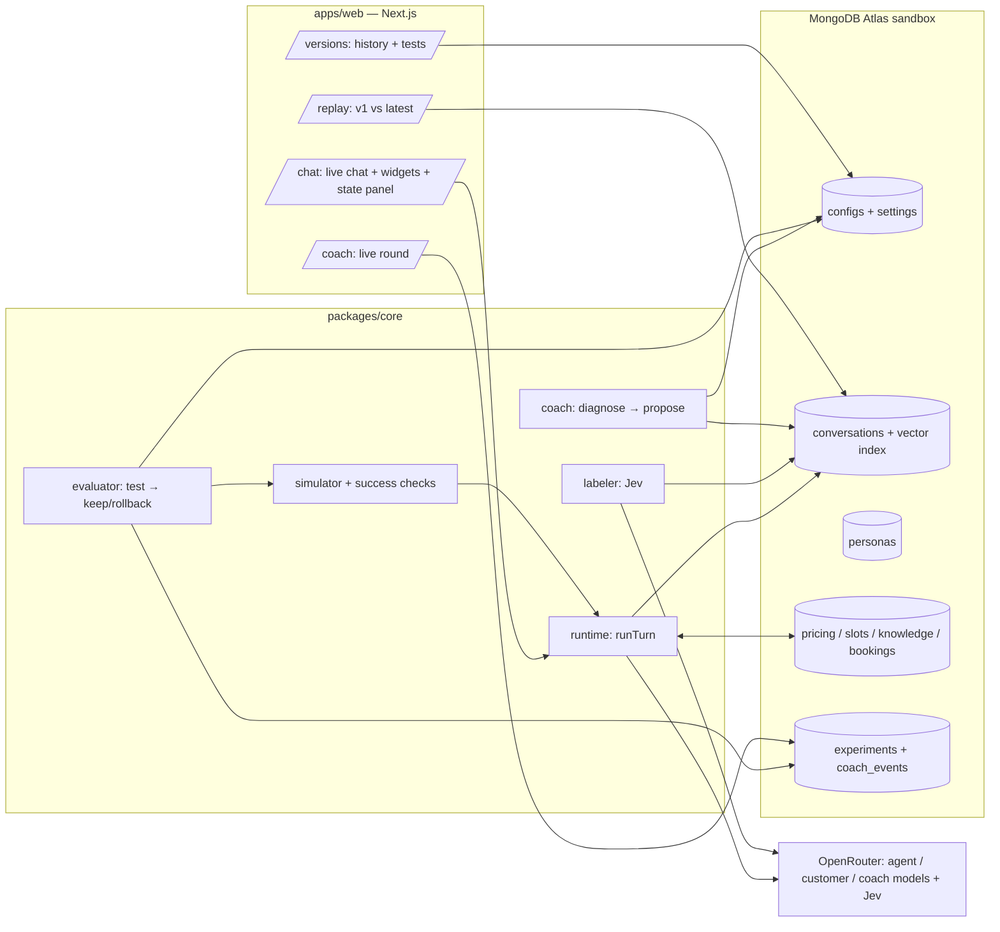

# Agent Evolve: Technical Architecture

A website chat agent that is given a goal and **evolves its own harness** to reach it. A coach agent reads the chat agent's conversations, which are classified and indexed in MongoDB Atlas. It proposes one typed change at a time to the agent's config (rules, tools, state, context, widgets, instructions), tests the change on practice customers, and keeps it only if the goal improves without breaking guardrails. Every version is stored in Atlas with its reason and evidence.

**Problem statement:** #1 Recursive Harnessing (the harness evolves its own rules, context policy, guardrails, and tool access), plus metric-driven long-running improvement from #2.

**Deadline:** submissions due **5:00 PM**. Record the 1-minute demo video by **4:30**.

---

## 1. Demo cases (confirm these before building data)

**Fictional company:** *Acme Analytics*, a B2B analytics dashboard (placeholder name). The chat agent lives on its pricing page.
**Goal:** "Book demos with qualified buyers; send everyone else to the self-serve trial."

### Pricing (source of truth, stored in `pricing`)
| Plan | $/seat/month | Seats | Key features |
|---|---|---|---|
| Starter | 12 | 1–10 | Dashboards, email support |
| Team | 25 | 5–100 | + integrations, priority support |
| Business | 45 | 20–500 | + SSO/SAML, audit logs, admin roles |
| Enterprise | custom | 200+ | + dedicated support, custom contract (requires a call) |

- Annual billing: pay for 10 months (2 months free).
- Volume discount: 10% off the seat price at 100+ seats (Team and Business).
- Self-serve 14-day free trial for Starter and Team.

**Qualified buyer (checked in code against the persona's hidden facts):** team size ≥ 20 **and** a need in {sso, security_review, integrations, enterprise}, **or** team size ≥ 200.

### The cases the demo shows
Each case is a demo persona with a fixed opening message and hidden facts. The side-by-side replay runs the same persona, the same opening message, and the same seed at temperature 0 against v1 and the latest version.

| # | Case | Persona (hidden) | v1 failure | Change we expect the coach to find | Visible after |
|---|---|---|---|---|---|
| C1 | **Email gate** | Head of Ops, 40 seats, needs SSO; leaves if asked for contact details before seeing a price | "Can I get your work email?" → customer leaves | Rule: no contact ask before a price is given (`tool_order` or `check`) + instructions edit | Price first, then qualification |
| C2 | **Wrong math** | IT lead, 120 seats, Business, annual billing | Agent does mental math and misquotes (misses volume/annual) | **Coach creates `calc_quote` template tool** + `quote_card` widget | Correct quote in a card |
| C3 | **Scheduling ping-pong** | Qualified VP, ready to meet, gives up after 2 scheduling exchanges | "What time works for you?" → back and forth → leaves | Enable `get_slots` + `slot_picker` widget + rewrite `book_meeting` description | One-click booking |
| C4 | **Unqualified booking** | Solo founder, 3 seats, asks to "talk to someone" | Agent books a sales call (wastes sales time) | Add `team_size` state fact + `book_meeting` requires it + send trial link | Trial link instead of a call |
| C5 | **Rejected change** | (any) | — | If the coach proposes something like "offer a discount to close," the locked rule catches it and the change is **rejected** | Shown in version history |

**Integrity rule:** the coach **never sees persona files or hidden facts**. It only sees transcripts, labels, and aggregate outcomes. It has to discover these patterns itself. If it doesn't find one, we run more rounds rather than hint.

---

## 2. System overview



The loop (`pnpm evolve`, a long-running local script, **never inside a request handler**):
**label new conversations → coach diagnoses → proposes one change → evaluator tests it → keep (new version, activate) or reject → repeat.**

---

## 3. Repo layout

```
agent-evolve/
├─ apps/web/                     Next.js 16 App Router + Tailwind 4 + shadcn/ui   (read apps/web/AGENTS.md first: Next 16 has breaking changes)
│  └─ src/app/
│     ├─ chat/  replay/  versions/  coach/
│     └─ api/chat  api/replay  api/versions  api/coach/round  api/coach/events
├─ packages/core/src/            pure TS, imported by web as @evolve/core
│  ├─ config/schema.ts           ★ shared contract: AgentConfig + ChangeOp (zod)
│  ├─ config/patch.ts            apply ChangeOps with a path whitelist + zod re-validation
│  ├─ types.ts                   ★ shared contract: Persona, Conversation, Turn, Outcome, Labels
│  ├─ runtime/                   runTurn, state update, rules, tools, widgets, prompt builder
│  ├─ tools/                     builtin tools + template-tool executor (MongoDB pipelines)
│  ├─ jev/                       evaluate() helpers (state extraction, checks, labels)
│  ├─ store/                     mongodb client, collections, queries, vector search
│  ├─ simulator/                 customer agent, conversation driver, success checks
│  ├─ coach/                     coach agent + its tools
│  ├─ evaluator/                 test protocol, accept/reject, versioning
│  ├─ data/                      generated seed data (pricing.json, knowledge/*.md, personas.json, v1-config.json)
│  └─ scripts/                   seed.ts, simulate.ts, label.ts, evolve.ts
└─ docs/ARCHITECTURE.md          this file
```

Package manager: `npx -y pnpm@9 …` works if pnpm isn't installed globally.

---

## 4. The config (the harness definition)

One document per version in `configs`. The schema is defined in `packages/core/src/config/schema.ts`. **Every element carries `introducedIn` (version) and `reason`**, so the UI can tag each behavior with the change that caused it.

| Area | Fields the coach may change | Enforced by |
|---|---|---|
| `instructions` | `persona`, `sections[]` (id, title, text) | prompt |
| `state` | fields: `question`, `type` (choice / yesno / text), `options`, `extractor` (jev / llm) | runtime: Jev each turn |
| `tools` | `description`, `enabled`, `requires[]` (state fields that must be known), `maxUses`; **create** `template` tools | runtime gating |
| `rules` | `tool_order` {require, before}, `limit` {tool, max}, `check` {question, onViolation: rewrite / block} | code (order, limit) + Jev (check) |
| `context` | trigger (`stateField = value`, or a Jev yes/no on the last customer message) → knowledge doc id | runtime |
| `widgets` | `template` (Markdown with `{placeholders}`), `dataFrom` (tool), `requires[]`, `maxPerChat`, `description` | runtime + UI |
| `routing` (if time) | default model + per-state overrides | runtime |

**Locked, so the coach can't edit them** (enforced in `patch.ts`): `goal`, `limits`, any rule with `locked: true`. The locked rules include:
- `check`: "Does the reply offer a discount or price not in the pricing sheet?" → block
- `check`: "Does the reply claim a feature the product doesn't have?" → block

**v1 config (deliberately weak, but realistic):**
- a generic "helpful sales assistant" persona and one instructions section
- tools: `get_price` (returns the list-price table), `ask_email`, `book_meeting` (vague description: "Books a meeting"), `send_trial_link`
- no state fields beyond `need`
- only the two locked rules
- no context triggers, no widgets

That gives the coach real room to improve.

### Template tools (the coach "writes a tool" without code)
```json
{ "kind": "template", "description": "Exact quote for a plan, seat count and billing period",
  "collection": "pricing",
  "params": { "plan": {"type":"enum","values":["starter","team","business"]},
              "seats": {"type":"number","min":1,"max":5000},
              "billing": {"type":"enum","values":["monthly","annual"]} },
  "pipeline": [ {"$match": {"plan": "{{plan}}"}}, {"$project": { "...": "..." }} ] }
```
- Parameters are validated and type-coerced before substitution. `{{x}}` is only replaced **inside string values**, never in keys.
- Allowed stages: `$match`, `$project`, `$addFields`, `$set`, `$group`, `$sort`, `$limit`, `$unwind`.
- Allowed collections: `pricing`, `slots`, `knowledge`.
- The evaluator runs the tool on sample inputs before accepting it.

### Change operations (`ChangeOp`)
`{op: "set" | "add" | "remove", path: "tools.book_meeting.description", value?}`. Paths use dots and must match the whitelist in `patch.ts`. After applying the ops, the whole config is re-parsed with zod; if it's invalid, the change is rejected.

Each proposal is: `{ ops[], area, reason, evidenceConversationIds[], targetFilter }`, where `targetFilter` is the conversation segment the change is meant to fix, e.g. `{"labels.failureType": "contact_before_price"}`.

---

## 5. Runtime (`runTurn`), owned by Person A

```ts
runTurn({ conversationId?, config, message, persona? /* sim only */, seed? }): Promise<{
  reply: string; widgets: RenderedWidget[]; state: Record<string, string|boolean|null>;
  toolCalls: ToolCallLog[]; ruleEvents: RuleEvent[]; provenance: number[]; ended: boolean
}>
```
**One turn:**
1. Append the customer message.
2. **Update state:** one Jev `evaluate()` call answers every `jev` state field. State = `{transcript so far}`. Choice fields → the choice; yes/no fields → `noul ≥ 0.5`; `text` fields → one cheap LLM extraction (only if any exist).
3. **Context:** for each trigger that fires, load the knowledge doc into the system prompt.
4. **Available tools:** `enabled && requires ⊆ known state fields && uses < maxUses`, plus `render_widget` if any widget's `requires` are met.
5. **Generate** with AI SDK `generateText({ model, system, messages, tools, stopWhen: stepCountIs(4) })`. Tools are defined with `execute` wrappers that **enforce `tool_order` and `limit` rules first**. A violation returns an error string to the model instead of executing.
6. **Check rules:** one Jev `evaluate()` call with every `check` question against `{last customer message, draft reply}`. On a violation: `rewrite` → regenerate once with feedback; `block` → a safe fallback reply. Log a `RuleEvent`.
7. **Widgets:** `render_widget(name)` fills the template from the latest output of its `dataFrom` tool. `{slots:button}` becomes a list of `[label](action:send?text=...)` links.
8. **Persist** the turn to `conversations`, including the state snapshot, tool calls, rule events, widgets, token usage/cost, and `provenance` (the `introducedIn` of every config element used).

**Built-in tools:**
- `get_price()` → the pricing table
- `ask_email()` → marks that contact details were requested
- `book_meeting({slot, name, email?})` → inserts into `bookings`
- `send_trial_link()` → returns the URL and marks it
- `get_slots()` → the next 3 slots from `slots`

Tool calls are the objective signal for success checks.

Jev in AI SDK 7:
```ts
import { evaluate } from "ai";
import { createOpenRouter } from "@openrouter/ai-sdk-provider";
const openrouter = createOpenRouter({ apiKey: process.env.OPENROUTER_API_KEY });
const r = await evaluate({ model: openrouter.evaluationModel("typesafe/jev-1.13"), state, questions });
// question types: noul {instructions, criteria:{true,false}} | choice {instructions, criteria:{key: desc}} | score {instructions, criteria:[levels]}
```
Check the exact types in `node_modules/ai/dist/index.d.ts` (search for `declare function evaluate`). Fallback if Jev errors: the same questions answered by the cheap LLM with structured output.

---

## 6. Data model (Atlas sandbox, database `evolve`)

| Collection | Shape (key fields) |
|---|---|
| `settings` | `{_id: "active", version}` |
| `configs` | `{version, parentVersion, status: active\|accepted\|rejected\|candidate, config, change: {ops, area, reason, evidenceConversationIds, targetFilter}, test: {target:{before,after,n}, regression:{before,after,n}, lockedViolations, costUsd}, createdAt}` |
| `personas` | `{_id, split: train\|heldout\|demo, caseId?, segment, opening, hidden: {role, teamSize, need, billing, plan?, budget, timeline}, behavior: {leavesIfContactBeforePrice, maxSchedulingExchanges, checksMath, readiness}, qualified}` |
| `conversations` | `{_id, personaId?, configVersion, source: sim\|live\|replay, runId, seed, turns: Turn[], outcome: {booked, qualified, success, trialSent, left, quoteCorrect?, turns, costUsd}, labels: {intent, dropStage, failureType, pushiness, violations[]}, summary, createdAt}` |
| `bookings` | `{conversationId, slot, name, email?}` |
| `pricing`, `slots`, `knowledge` | static seed data |
| `experiments` | `{round, baseVersion, candidateVersion, proposal, results, decision, notes, createdAt}` |
| `coach_events` | `{round, ts, type: thinking\|tool_call\|proposal\|test_progress\|decision, payload}`; the UI polls these |

**Indexes (a free tier allows only 3 search/vector indexes in total):**
1. **Vector index on `conversations.summary`.** Prefer **Automated Embedding** (`type: "autoEmbed"`, model `voyage-4`) with filter fields `configVersion`, `labels.failureType`, `labels.intent`, `outcome.success`. Fallback: embed with Voyage ourselves into `summaryEmbedding` (`vector` type, 1024 dims).
2. (Optional) an Atlas Search index on `conversations.summary` for keyword search.

Regular indexes: `conversations {configVersion, "labels.failureType"}` and `configs {version}`.

---

## 7. Data generation + simulator + labeling, owned by Person B

**Seed data (`pnpm seed`):**
- `pricing` (table above)
- `slots` (the next 5 business days, 3 slots per day)
- `knowledge`: features, security/SSO, integrations, FAQ, and a competitor comparison against the fictional competitor *DashCo*
- the **v1 config**, marked active

**Personas:**
- **32 generated** (24 train, 8 held-out) across a grid of segments (qualified-SSO, qualified-integrations, enterprise 200+, small team, solo/student, price-shopper, competitor-switcher) × behaviors (contact-averse, impatient scheduler, math-checker, ready-to-buy).
- Generated by the strong LLM with zod validation. `qualified` is **computed in code**, not generated.
- **Plus 4 hand-written demo personas (C1–C4).**

**Customer agent (`simulator/customer.ts`):**
- A cheap model at temperature 0, prompted with the persona.
- It reveals hidden facts only when asked or naturally, follows its behavior rules, and may "click" a widget button by replying with that button's text.
- It ends by writing `[LEAVE]` or `[DONE]`. Max 10 turns.

**Success checks (`simulator/checks.ts`), all deterministic:**
- `booked`: a `bookings` row exists for the conversation.
- `success`: `qualified ? booked : (trialSent && !booked)`.
- `quoteCorrect`: every $ amount the agent quoted matches the true price from `pricing` within 1%.
- `lockedViolations`: count of blocked locked-rule events.

**`pnpm simulate`:**
- Runs every train + held-out persona × 2 seeds against the active config: about 64 conversations, 12 in parallel.
- Each coach test adds more, so the corpus grows through the day.

**Labeling (`pnpm label`):** one Jev `evaluate()` per conversation over the transcript:
- `intent` (choice: pricing, sso_security, integrations, scheduling, trial, support, other)
- `dropStage` (choice: greeting, discovery, pricing, qualification, scheduling, none)
- `failureType` (choice: contact_before_price, wrong_quote, scheduling_friction, unqualified_booking, missed_qualification, generic_answer, none)
- `pushiness` (score 1–4)
- plus a one-paragraph `summary` from the cheap LLM (the text that gets embedded)

---

## 8. Coach + evaluator, owned by Person B

**Coach (strong model, `generateText` with tools, ≤12 steps per round).**

Inputs: the goal, the active config, the list of past experiments (so it doesn't repeat itself), and the locked fields.

Tools:
- `stats({groupBy, filter})`: aggregation that returns counts and success rate per group, e.g. by `labels.failureType` for the active version
- `search({query, filter, k})`: `$vectorSearch` over conversation summaries
- `read({conversationId})`: the full transcript with tool calls and rule events
- `getConfig()` / `listExperiments()`
- `propose({ops, area, reason, evidenceConversationIds, targetFilter})`: validated with `patch.ts`; returns errors so the coach can fix them. Ends the round.

**Evaluator (plain code, not an LLM):**
1. **Target set:** train personas whose latest conversation on the active version matches `targetFilter` and failed (cap 10).
2. **Regression set:** 6 train personas that succeeded on the active version.
3. Run both sets against the **candidate** config with the same seeds. Base results come from the latest runs on the active version with those seeds.
4. **Accept** if:
   - target successes improve by ≥ 2, **and**
   - regression successes don't drop, **and**
   - locked violations = 0, **and**
   - any template tool passed its sample-input test.
5. If accepted: `status: accepted`, becomes active, version + 1. Otherwise: `status: rejected`, with the reason recorded.
6. Every 3 accepted versions, run the held-out personas and record the headline.

Every step writes a `coach_events` document, which the UI shows live.

`pnpm evolve --rounds 20` loops: label → coach → evaluate. Each round takes about 1–3 minutes.

---

## 9. Web app, owned by Person A

| Page | What it shows |
|---|---|
| `/chat` | Version picker. Chat with Markdown widgets (buttons send preset text). **"What the bot knows"** panel (state fields filling in). Unlocked tools. Rule events. Each agent message is tagged with the versions of the config elements it used. |
| `/replay` | Pick a demo case → v1 vs latest side by side (reads stored replay conversations; a button re-runs them). Differences are tagged with the change that caused them (from `provenance`). |
| `/versions` | Timeline v1 → vN: area (color-coded), reason, ops diff, evidence links, the change's own test result ("target 1/10 → 8/10, regression 6/6"), and accepted/rejected. |
| `/coach` | Goal box + "Run one round" → polls `coach_events`: the coach's queries, its proposal, test progress, and the decision. |

**API routes:**
- `POST /api/chat`
- `POST /api/replay`
- `GET /api/versions`
- `POST /api/coach/round` (starts one round in the background, returns `roundId`)
- `GET /api/coach/events?round=` (polling)

Keep the UI simple: shadcn Card / Badge / Tabs / ScrollArea.

---

## 10. Models (via OpenRouter; confirm IDs at the start)

| Role | Choice | Why |
|---|---|---|
| Chat agent | cheap, fast, reliable tool calling | many calls |
| Customer simulator | same cheap model | many calls |
| Coach | strong reasoning model | a few calls per round |
| State / checks / labels | Jev `typesafe/jev-1.13` via `evaluationModel` | fast typed decisions at volume |
| Summaries | cheap model | |

Environment: `.env.local` at the repo root (see `.env.example`):
- `MONGODB_URI` (Atlas sandbox cluster; **add the venue IP to Network Access**)
- `MONGODB_DB=evolve`
- `OPENROUTER_API_KEY`
- `VOYAGE_API_KEY` (only if Automated Embedding isn't available)

---

## 11. Work split and timeline (from ~1:15 PM)

| Time | Person A: runtime + web | Person B: data + simulator + coach |
|---|---|---|
| 1:15–1:30 | **Both:** read this doc, `.env.local`, confirm Atlas connection + models, lock the demo cases | same |
| 1:30–2:30 | `runtime/` (state via Jev, tool gating, rules, template-tool executor, widgets, persist) + a CLI chat to test | `seed` (pricing, slots, knowledge, v1 config), personas (32 + 4 demo), `store/` helpers, vector index |
| **2:30 checkpoint** | `runTurn` works end to end on v1 | seed data in Atlas; personas ready |
| 2:30–3:15 | `/chat` page + `/api/chat` | `simulator/` + checks → `pnpm simulate` on v1 → `pnpm label` |
| 3:15–4:00 | `/versions`, `/replay`, `/coach` pages | `coach/` + `evaluator/` → `pnpm evolve` running |
| 4:00–4:20 | Both: run evolve, check C1–C4 play out, record replays, fix bugs | same |
| 4:20–4:40 | **Record the 1-minute video** (demo script below) | |
| 4:40–5:00 | README (what we built today, how to run), confirm repo is public, submit, add all members | |

**Contracts to agree on first (both import these):**
- `config/schema.ts`
- `types.ts`
- the `runTurn` signature above

Person B can build the simulator against `runTurn` before it's finished by stubbing it.

---

## 12. Demo script (about 3 minutes, no slides)
1. "This chat agent sells an analytics product. Its goal: book demos with qualified buyers. We gave it a basic config at 1:30 and let it evolve."
2. **`/replay` C1 + C3:** the same customer on v1 vs the latest. v1 asks for an email and loses them; the latest gives the price and then a one-click slot picker. Point at the tags ("rule added in v3," "widget created in v6").
3. **`/versions`:** each change has its own test. Show the **coach-created `calc_quote` tool** (C2) and a **rejected** change. Point out Atlas: versions, conversations, and vector search.
4. **`/coach`:** run one round live and narrate its queries → proposal → test → decision.
5. **`/chat`:** a judge plays a customer. Watch the state panel fill in and widgets appear.

## 13. Risks and fallbacks
- **Automated Embedding unavailable on the sandbox tier** → embed with Voyage manually (same index, `vector` type).
- **Jev errors or rate limits** → fall back to the cheap LLM with structured output.
- **The coach doesn't find a demo case's fix in time** → run more rounds overnight before the Sep 30 finals. For Saturday, show the changes it did find. **Don't hand-write changes and present them as the coach's.**
- **A live coach round is too slow** → show the most recent completed round from `coach_events`.
- **Atlas connection refused at the venue** → add the current IP in Atlas Network Access.

## 14. Submission checklist
- [ ] Repo public, all team members added on the Cerebral Valley submission page
- [ ] README states clearly **what was built during the event** (all of it) and how to run it
- [ ] 1-minute video with working audio: replay, versions with a coach-made tool, live coach round
- [ ] Project built in the **Atlas Hackathon Sandbox** cluster
